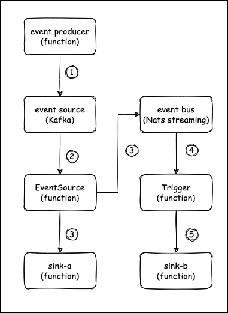

## Walkthroughs

### Prerequisites

- Dapr, refer to [Getting started with Dapr](https://docs.dapr.io/getting-started/) to install Dapr

- Kubectl, refer to [Install Kubectl](https://kubernetes.io/docs/tasks/tools/#kubectl) to install Kubectl (Also you better have a k8s cluster)

- A Knative runtime function (target function)

  You can refer to [Sample Function Go](https://github.com/OpenFunction/samples/tree/main/functions/Knative/hello-world-go) to create a Knative runtime function.

- A Kafka server (event source)

  - Install [strimzi-kafka-operator](https://github.com/strimzi/strimzi-kafka-operator) in the default namespace.

    ```shell
    helm repo add strimzi https://strimzi.io/charts/
    helm install kafka-operator -n default strimzi/strimzi-kafka-operator
    ```

  - Run the following command to create a Kafka cluster ("kafka-server") and Kafka Topic ("demo") in the default namespace. The Kafka and Zookeeper clusters created by this command have a storage type of **ephemeral** and are demonstrated using emptyDir.

    ```shell
    kubectl apply -f examples/kafka.yaml
    ```

- A Nats streaming server (event bus)

  You can refer to [Deploy NATS on Kubernetes with Helm Charts](https://nats-io.github.io/k8s/) to deploy a Nats streaming server.

  Here I assume that the access address of this NATS Streaming server is `nats://nats.default:4222` and the cluster ID is `stan`.

  ```shell
  helm repo add nats https://nats-io.github.io/k8s/helm/charts/
  helm install nats nats/nats
  helm install stan nats/stan --set stan.nats.url=nats://nats:4222
  ```

### Process Descriptions



1. The event producer periodically generates events and outputs them to the kafka server (topic: demo)
2. The EventSource associates with the kafka server and reads events from the kafka server (topic: demo)
3. The EventSource sends the read events to the sink-a function and the event bus (Nats streaming server) in the {namespace}-{EventSource name}-{Event name} format, as required by the configuration
4. The Trigger associates with the event bus (Nats streaming server) and subscribes to events from it
5. The Trigger sends the events that meet the trigger conditions to the corresponding subscriber sink-b function according to the configuration

### Sink

You can deploy two Knative runtime based functions as sink trigger targets with the following command:

```shell
kubectl apply -f examples/sink.yaml
```

You can observe the status of these two functions, and their access addresses as follows:

```shell
~# kubectl get functions.core.openfunction.io
NAME                  BUILDSTATE   SERVINGSTATE   BUILDER         SERVING         URL                                     AGE
sink-a                Skipped      Running                        serving-gzw2b   http://openfunction.io/default/sink-a   21s
sink-b                Skipped      Running                        serving-6zdhd   http://openfunction.io/default/sink-b   21s
```

### EventSource

We could do this directly using the EventSource resource, but that may not be intuitive enough, so we will do the EventSource implementation through a function.

> If you expect to customize the eventsource handler, then you can open the uncomment the `spec.build` section and change the `spec.image` and `spec.imageCredentials.name` sections so that you can upload the image after the build properly.

```shell
kubectl apply -f examples/eventsource.yaml
```

And `spec.serving.params.CONFIG` is a base64-encoded content which contains the information of the `Config` structure:

````go
type Config struct {
	EventBusOutputName string `json:"eventBusOutputName,omitempty"`
	EventBusTopic      string `json:"eventBusTopic,omitempty"`
	SinkOutputName     string `json:"sinkOutputName,omitempty"`
	LogLevel           string `json:"logLevel,omitempty"`
	Port               string `json:"port,omitempty"`
}
````

This means that you need to regenerate the corresponding `spec.serving.params.CONFIG` data after updating the function's content.

You can observe the status of `my-eventsource` function as follows:

```shell
~# kubectl get functions.core.openfunction.io
NAME                  BUILDSTATE   SERVINGSTATE   BUILDER         SERVING         URL                                     AGE
my-eventsource        Skipped      Running                        serving-dm82v                                           9m36s

~# kubectl logs $(kubectl get po -l openfunction.io/serving=$(kubectl get functions my-eventsource -o jsonpath='{.status.serving.resourceRef}') -o jsonpath='{.items[0].metadata.name}') function
dapr client initializing for: 127.0.0.1:50001
I0309 04:02:05.464460       1 framework.go:110] Plugins for pre-hook stage:
I0309 04:02:05.464679       1 framework.go:118] Plugins for post-hook stage:
dapr client initializing for: 127.0.0.1:50001
dapr client initializing for: 127.0.0.1:50001
I0309 04:02:08.474553       1 async.go:111] registered bindings handler: serving-dm82v-component-esc-kafka-sample-one-b4gr5
I0309 04:02:08.474585       1 async.go:53] Async Function serving grpc: listening on port 8080
```

### Trigger

We could do this directly using the Trigger resource, but that may not be intuitive enough, so we will do the Trigger implementation through a function.

> If you expect to customize the trigger handler, then you can open the uncomment the `spec.build` section and change the `spec.image` and `spec.imageCredentials.name` sections so that you can upload the image after the build properly.

```shell
kubectl apply -f examples/trigger.yaml
```

And `spec.serving.params.CONFIG` is a base64-encoded content which contains the information of the `Config` structure:

````go
type Config struct {
	EventBusComponent string                 `json:"eventBusComponent,omitempty"`
	Inputs            []*Input               `json:"inputs,omitempty"`
	Subscribers       map[string]*Subscriber `json:"subscribers,omitempty"`
	LogLevel          string                 `json:"logLevel,omitempty"`
	Port              string                 `json:"port,omitempty"`
}
````

This means that you need to regenerate the corresponding `spec.serving.params.CONFIG` data after updating the function's content.

You can observe the status of `my-trigger` function as follows:

```shell
~# kubectl get functions.core.openfunction.io
NAME           BUILDSTATE   SERVINGSTATE   BUILDER   SERVING         URL   AGE
my-trigger     Skipped      Running                  serving-dgk2h         2m52s

~# kubectl logs $(kubectl get po -l openfunction.io/serving=$(kubectl get functions my-trigger -o jsonpath='{.status.serving.resourceRef}') -o jsonpath='{.items[0].metadata.name}') function
I0309 07:07:54.561128       1 framework.go:110] Plugins for pre-hook stage:
I0309 07:07:54.561198       1 framework.go:118] Plugins for post-hook stage:
dapr client initializing for: 127.0.0.1:50001
dapr client initializing for: 127.0.0.1:50001
dapr client initializing for: 127.0.0.1:50001
I0309 07:07:57.567587       1 async.go:143] registered pubsub handler: serving-dgk2h-component-ebft-my-trigger-n4xkh, topic: default-my-eventsource-sample-one
I0309 07:07:57.567623       1 async.go:53] Async Function serving grpc: listening on port 8080
```

### Producer

By following the steps above we have deployed the entire events framework, now we need to feed some events into this framework so that we can observe its working mechanism.

```shell
kubectl apply -f examples/producer.yaml
```

Once the producer function has been deployed and started working, we can observe the changes in the two sink functions mentioned before:

```shell
~# kubectl logs $(kubectl get po -l openfunction.io/serving=$(kubectl get functions sink-a -o jsonpath='{.status.serving.resourceRef}') -o jsonpath='{.items[0].metadata.name}') function
I0309 07:56:05.028268       1 main.go:16] {"message":"Hello"}
I0309 07:56:07.020260       1 main.go:16] {"message":"Hello"}
I0309 07:56:09.048158       1 main.go:16] {"message":"Hello"}
I0309 07:56:11.027318       1 main.go:16] {"message":"Hello"}
I0309 07:56:13.042366       1 main.go:16] {"message":"Hello"}
I0309 07:56:15.022253       1 main.go:16] {"message":"Hello"}
I0309 07:56:17.019477       1 main.go:16] {"message":"Hello"}
I0309 07:56:19.018054       1 main.go:16] {"message":"Hello"}
I0309 07:56:21.017014       1 main.go:16] {"message":"Hello"}
I0309 07:56:23.035163       1 main.go:16] {"message":"Hello"}
I0309 07:56:25.012834       1 main.go:16] {"message":"Hello"}

~# kubectl logs $(kubectl get po -l openfunction.io/serving=$(kubectl get functions sink-b -o jsonpath='{.status.serving.resourceRef}') -o jsonpath='{.items[0].metadata.name}') function
I0309 07:56:25.012492       1 main.go:16] {"message":"Hello"}
I0309 07:56:27.034405       1 main.go:16] {"message":"Hello"}
I0309 07:56:29.045461       1 main.go:16] {"message":"Hello"}
I0309 07:56:31.049167       1 main.go:16] {"message":"Hello"}
I0309 07:56:33.061793       1 main.go:16] {"message":"Hello"}
I0309 07:56:35.026477       1 main.go:16] {"message":"Hello"}
I0309 07:56:37.012498       1 main.go:16] {"message":"Hello"}
I0309 07:56:39.047846       1 main.go:16] {"message":"Hello"}
I0309 07:56:41.123002       1 main.go:16] {"message":"Hello"}
I0309 07:56:43.042297       1 main.go:16] {"message":"Hello"}
I0309 07:56:45.013451       1 main.go:16] {"message":"Hello"}
```

